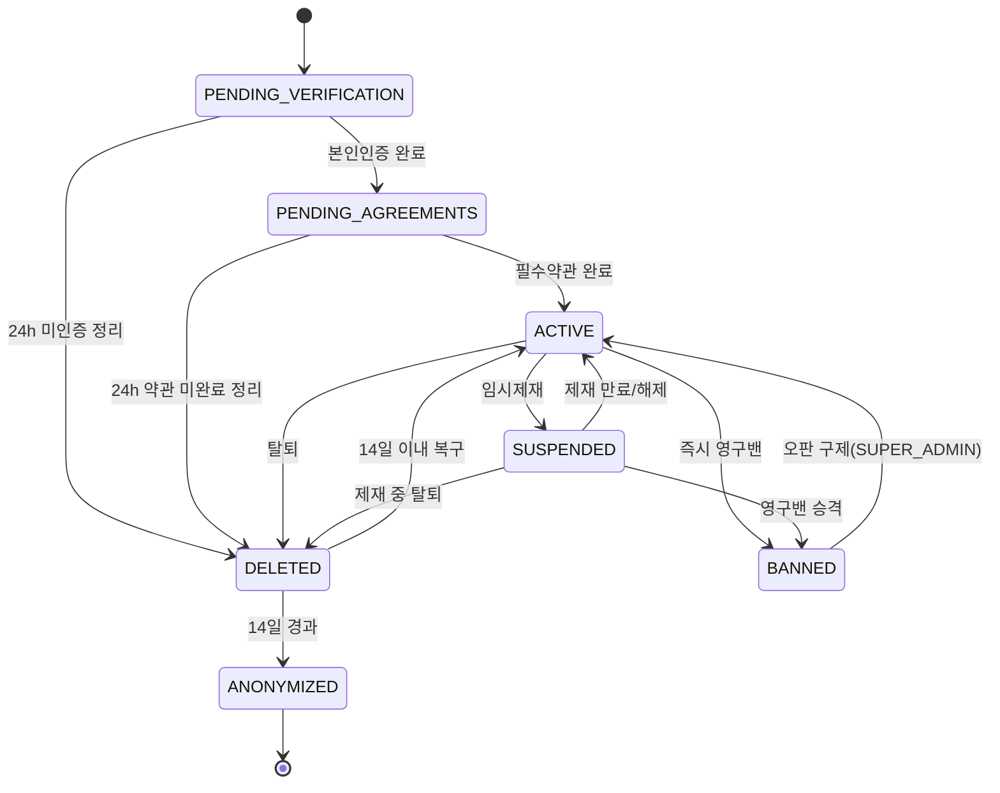
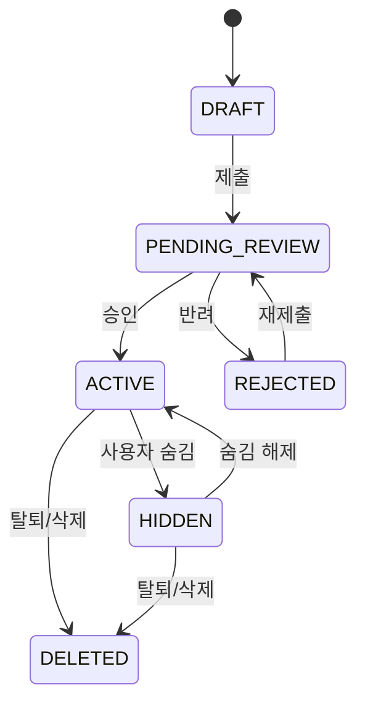
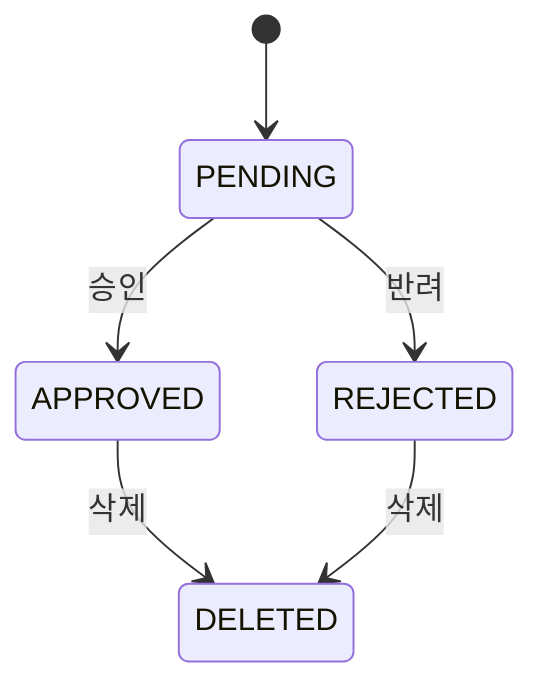
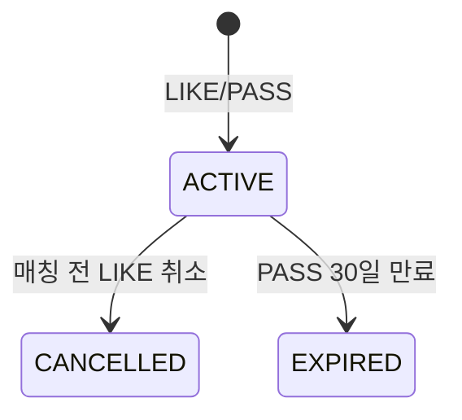
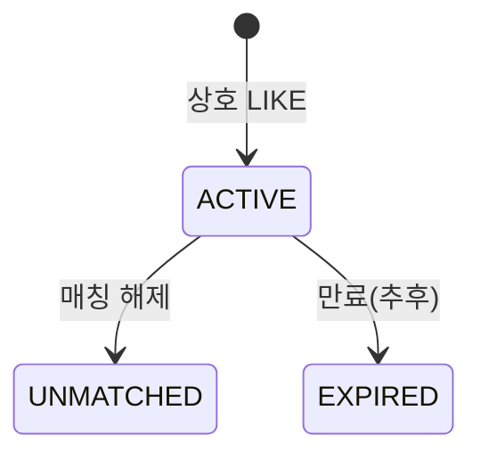
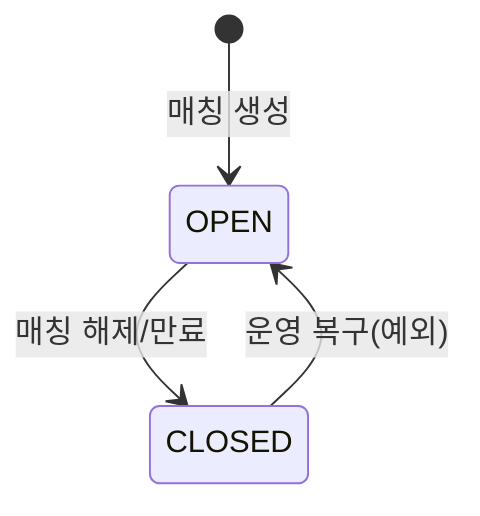
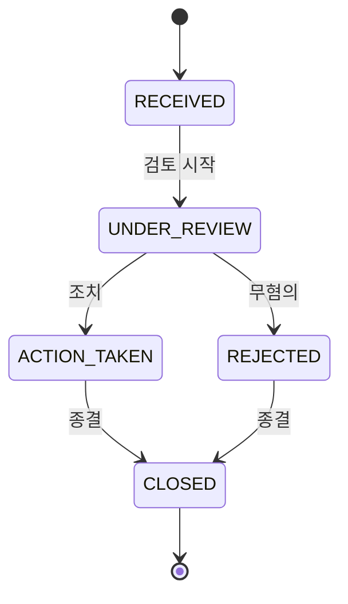
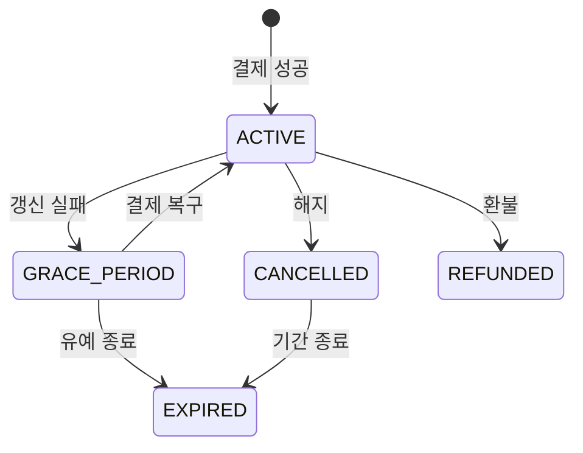
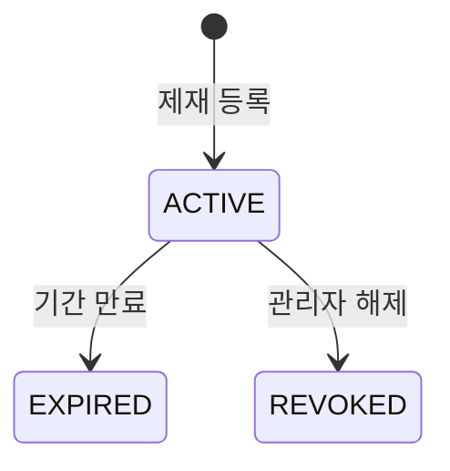

# 상태 전이 상세 문서

- 문서 버전: v1.1
- 작성일: 2026-06-19
- 기준 문서: 소개팅 앱 개발 정책 문서 v1.2
- 대상: USERS / PROFILES / PROFILE_PHOTOS / USER_REACTIONS / MATCHES / CHAT_ROOMS / REPORTS / SUBSCRIPTIONS / SANCTIONS

---

## 0. 공통 규칙

- 모든 `DELETED`는 물리 삭제가 아니라 soft delete(`deleted_at` 기록)를 의미한다. 물리 삭제는 보존 정책(정책 문서 20장)에 따라 별도 배치로 처리한다.
- 표의 **주체(Actor)** 표기는 다음과 같다.
  - `USER` : 사용자 본인 액션
  - `ADMIN` : 관리자 액션 (역할별 권한은 정책 문서 19.3)
  - `SYSTEM` : 서버 로직 / 스케줄러 / 배치
  - `WEBHOOK` : 외부(스토어/PG/본인인증) 콜백
- **가드(Guard)** 는 전이가 허용되기 위한 전제조건이다. 가드를 만족하지 않는 전이 요청은 거부한다.
- 표에 명시되지 않은 전이는 모두 **금지**한다. (애플리케이션 레벨에서 차단하고, 가능한 경우 DB CHECK로 보강)
- 상태 변경은 감사가 필요한 경우 `ADMIN_AUDIT_LOGS` 또는 도메인 이력 테이블에 기록한다.

---

## 1. USERS.status

### 1.1 상태 정의

| 상태 | 의미 | 진입 시점 |
|---|---|---|
| `PENDING_VERIFICATION` | 가입 진행 중, 본인인증 미완료 | OAuth 로그인 직후 |
| `PENDING_AGREEMENTS` | 본인인증 완료, 필수약관 미완료 | 본인인증 성공 직후 |
| `ACTIVE` | 정상 이용 가능 | 본인인증 + 필수약관 완료 |
| `SUSPENDED` | 임시 제재, 쓰기 제한 | 관리자 임시제재 |
| `BANNED` | 영구 차단, 로그인 불가 | 관리자 영구밴 |
| `DELETED` | 탈퇴(soft delete), 14일 복구 가능 | 탈퇴 요청 |
| `ANONYMIZED` | 가명처리 완료, 복구 불가 (종착) | 탈퇴 14일 경과 |

### 1.2 다이어그램



### 1.3 전이표

| From | To | 트리거 | 가드 | 부수효과 | 주체 |
|---|---|---|---|---|---|
| `PENDING_VERIFICATION` | `PENDING_AGREEMENTS` | 본인인증 콜백 | 인증성공 ∧ 만19세↑ ∧ DI 중복/밴 차단 통과 | 본인인증 정보 저장 | WEBHOOK/SYSTEM |
| `PENDING_AGREEMENTS` | `ACTIVE` | 필수약관 동의 완료 | 필수약관 최신 버전 동의 | 세션 발급 허용, 프로필 작성 가능 | SYSTEM |
| `PENDING_VERIFICATION` | `DELETED` | 미인증 정리 배치 | `created_at + 24h` 경과 ∧ 미인증 | soft delete | SYSTEM |
| `PENDING_AGREEMENTS` | `DELETED` | 약관 미완료 정리 배치 | 본인인증 후 24h 경과 ∧ 필수약관 미동의 | soft delete | SYSTEM |
| `ACTIVE` | `SUSPENDED` | 임시제재 등록 | 관리자 권한 ∧ 제재 사유 | SANCTIONS 생성, 쓰기 제한 | ADMIN |
| `ACTIVE` | `BANNED` | 영구밴 | 심각 위반 ∧ 관리자 권한 | 전 세션 폐기, DI 차단리스트 등록 | ADMIN |
| `ACTIVE` | `DELETED` | 탈퇴 요청 | 본인 인증된 요청 | 전 세션 폐기, 추천/매칭/채팅 제외, soft delete | USER |
| `SUSPENDED` | `ACTIVE` | 제재 만료/해제 | 제재기간 만료 ∨ 관리자 해제 | 쓰기 기능 복구 | SYSTEM/ADMIN |
| `SUSPENDED` | `BANNED` | 영구밴 승격 | 반복/심각 위반 | DI 차단리스트 등록 | ADMIN |
| `SUSPENDED` | `DELETED` | 제재 중 탈퇴 | 본인 요청 | 활성 제재 잔여를 SANCTIONS에 보존(리셋 금지) | USER |
| `BANNED` | `ACTIVE` | 오판 구제 | `SUPER_ADMIN` 한정 | DI 차단 해제, 사유 감사로그 | ADMIN |
| `DELETED` | `ACTIVE` | 복구 | 탈퇴 후 14일 이내 로그인 | 상태 복구, 복구 이력 기록 | USER |
| `DELETED` | `ANONYMIZED` | 가명처리 배치 | 탈퇴 후 14일 경과 | 개인정보 파기/가명처리, 보존의무분만 잔존 | SYSTEM |

### 1.4 메모

- `ANONYMIZED`는 종착 상태이며, 어떤 전이도 나가지 않는다.
- `BANNED`에서 나가는 전이는 `SUPER_ADMIN` 수동 해제뿐이다. (오판 구제 경로)
- `SUSPENDED → DELETED` 시 제재 잔여를 반드시 보존해야 재가입 시 승계가 가능하다. (제재 회피 방지, 정책 16.5)

---

## 2. PROFILES.status

### 2.1 상태 정의

| 상태 | 의미 |
|---|---|
| `DRAFT` | 작성 중, 미제출 |
| `PENDING_REVIEW` | 검수 대기 |
| `ACTIVE` | 공개/추천 노출 가능 |
| `REJECTED` | 검수 반려 |
| `HIDDEN` | 사용자 숨김, 신규 추천 제외 |

### 2.2 다이어그램



### 2.3 전이표

| From | To | 트리거 | 가드 | 부수효과 | 주체 |
|---|---|---|---|---|---|
| `DRAFT` | `PENDING_REVIEW` | 프로필 제출 | 필수항목 충족 ∧ 대표사진 업로드 | 검수 큐 등록 | USER |
| `PENDING_REVIEW` | `ACTIVE` | 검수 승인 | 검수 통과 ∧ 승인 사진 1장↑ | 추천 노출 가능 | ADMIN/SYSTEM |
| `PENDING_REVIEW` | `REJECTED` | 검수 반려 | 반려 사유 | 반려 알림 | ADMIN/SYSTEM |
| `REJECTED` | `PENDING_REVIEW` | 재제출 | 수정 완료 | 검수 큐 재등록 | USER |
| `ACTIVE` | `HIDDEN` | 숨김 | 본인 요청 | 신규 추천 제외, LIKE 발송 제한, 받은 LIKE 조회 유지 | USER |
| `HIDDEN` | `ACTIVE` | 숨김 해제 | 본인 요청 ∧ 계정 ACTIVE | 추천 노출 재개 | USER |
| `ACTIVE` / `HIDDEN` | `DELETED` | 탈퇴/삭제 | USERS soft delete 연동 | soft delete | USER/SYSTEM |

### 2.4 메모

- 프로필 공개(추천 노출)는 `PROFILES.status = ACTIVE` ∧ `USERS.status = ACTIVE` ∧ 승인 사진 1장↑를 모두 만족해야 한다. (정책 7.1)
- `HIDDEN`은 매칭/채팅을 유지한다. 추천 노출만 중단된다.

---

## 3. PROFILE_PHOTOS.status

### 3.1 상태 정의

| 상태 | 의미 |
|---|---|
| `PENDING` | 업로드 직후, 검수 대기 |
| `APPROVED` | 승인, 노출 가능 |
| `REJECTED` | 반려 |
| `DELETED` | soft delete (이후 물리삭제 예약) |

### 3.2 다이어그램



### 3.3 전이표

| From | To | 트리거 | 가드 | 부수효과 | 주체 |
|---|---|---|---|---|---|
| `PENDING` | `APPROVED` | 검수 승인 | 검수 SLA 내 처리(목표 24h) | 노출 가능, 대표사진 후보 | ADMIN/SYSTEM |
| `PENDING` | `REJECTED` | 검수 반려 | 반려 사유 코드 | 반려 알림 | ADMIN/SYSTEM |
| `APPROVED` | `DELETED` | 삭제 | 본인 요청 ∨ 정책 | soft delete, 30일 후 물리삭제 예약 | USER/SYSTEM |
| `REJECTED` | `DELETED` | 삭제 | 본인 요청 ∨ 정리 | soft delete | USER/SYSTEM |

### 3.4 메모

- 대표 사진은 `APPROVED` 상태에서만 설정 가능하다. (정책 8.2)
- 신고 관련 사진은 신고 처리 완료 전까지 물리삭제를 보류한다. (정책 8.5 / 15.5)
- 불법 콘텐츠 신고 시 즉시 비공개 처리하되, 자료 보존을 위해 물리삭제는 보류한다. (정책 15.5)

---

## 4. USER_REACTIONS.status

### 4.1 상태 정의

| 상태 | 의미 |
|---|---|
| `ACTIVE` | 현재 유효한 LIKE/PASS |
| `CANCELLED` | 매칭 전 LIKE 취소 |
| `EXPIRED` | PASS 재노출 제한 만료 등으로 비활성화 |

### 4.2 다이어그램



### 4.3 전이표

| From | To | 트리거 | 가드 | 부수효과 | 주체 |
|---|---|---|---|---|---|
| `[*]` | `ACTIVE` | LIKE/PASS 생성 | 활성 pair 중복 없음 | LIKE면 상호 LIKE 검사, PASS면 30일 재노출 제한 시작 | USER |
| `ACTIVE` | `CANCELLED` | LIKE 취소 | 매칭 전 LIKE | 새 반응 가능, 기존 이벤트는 보존 | USER |
| `ACTIVE` | `EXPIRED` | PASS 만료 배치 | PASS 후 30일 경과 | 낮은 우선순위로 재노출 가능 | SYSTEM |

### 4.4 메모

- 현재 활성 반응은 `(actor_user_id, target_user_id) WHERE status = ACTIVE` 부분 유니크로 보장한다.
- PASS가 `EXPIRED` 되면 같은 대상에게 새 LIKE/PASS가 가능하다.
- 매칭 해제 후 재추천 제외가 필요한 경우 기존 LIKE를 `ACTIVE`로 유지하거나 별도 UNMATCHED 기록을 추천 제외 조건에 사용한다.

---

## 5. MATCHES.status

### 5.1 상태 정의

| 상태 | 의미 |
|---|---|
| `ACTIVE` | 매칭 성립, 채팅 가능 |
| `UNMATCHED` | 매칭 해제 |
| `EXPIRED` | 만료 (MVP 미사용, 추후) |

### 5.2 다이어그램



### 5.3 전이표

| From | To | 트리거 | 가드 | 부수효과 | 주체 |
|---|---|---|---|---|---|
| `[*]` | `ACTIVE` | 상호 LIKE 성립 | 양방향 LIKE ∧ 중복 매칭 없음 | CHAT_ROOM 생성(동일 트랜잭션) | SYSTEM |
| `ACTIVE` | `UNMATCHED` | 매칭 해제 | 일방 요청 | CHAT_ROOM `CLOSED`, USER_REACTIONS 유지(재추천 제외), 푸시 미발송 | USER |
| `ACTIVE` | `EXPIRED` | 만료 배치 | (추후) 만료 정책 도입 시 | CHAT_ROOM `CLOSED` | SYSTEM |

### 5.4 메모

- 매칭 생성은 멱등 처리한다. 동시 상호 LIKE로 unique 위반 시 예외가 아니라 기존 MATCH를 반환한다. (정책 12.1 / 23)
- `UNMATCHED` 이후 재매칭은 기본 불가하며, 양쪽 모두 추천에서 제외한다. (정책 10.1 / 12.3)
- 차단은 MATCHES.status를 바꾸지 않는다. 채팅 가능 여부는 USER_BLOCKS를 함께 검사한다. (정책 13.2)

---

## 6. CHAT_ROOMS.status

### 6.1 상태 정의

| 상태 | 의미 |
|---|---|
| `OPEN` | 메시지 송수신 가능 |
| `CLOSED` | 채팅 불가 (방은 보존) |

### 6.2 다이어그램



### 6.3 전이표

| From | To | 트리거 | 가드 | 부수효과 | 주체 |
|---|---|---|---|---|---|
| `[*]` | `OPEN` | 매칭 생성 | MATCH `ACTIVE` | 멤버 등록 | SYSTEM |
| `OPEN` | `CLOSED` | 매칭 해제 ∨ 만료 | UNMATCH ∨ 만료 발생 | 메시지 전송 차단 | USER/SYSTEM |
| `CLOSED` | `OPEN` | 운영 복구 | 잘못 닫힌 방 복구 ∧ 매칭 `ACTIVE` ∧ 양쪽 차단 없음 ∧ 양쪽 `ACTIVE` | 메시지 전송 재개 | ADMIN/SYSTEM |

### 6.4 채팅 가능 조건 (전이와 별개의 런타임 게이트)

```text
매칭 ACTIVE
AND 채팅방 OPEN
AND 양쪽 모두 차단 관계 없음
AND 양쪽 모두 USERS.status = ACTIVE
```

- 차단은 CHAT_ROOMS.status를 변경하지 않고 런타임 게이트로 막는다. 차단 해제 시 매칭이 `ACTIVE`이고 방이 `OPEN`이면 즉시 채팅 가능하다. (정책 13.2)

---

## 7. REPORTS.status

### 7.1 상태 정의

| 상태 | 의미 |
|---|---|
| `RECEIVED` | 접수 |
| `UNDER_REVIEW` | 검토 중 |
| `ACTION_TAKEN` | 조치 완료 |
| `REJECTED` | 반려(무혐의) |
| `CLOSED` | 종결 |

### 7.2 다이어그램



### 7.3 전이표

| From | To | 트리거 | 가드 | 부수효과 | 주체 |
|---|---|---|---|---|---|
| `[*]` | `RECEIVED` | 신고 접수 | 24h 내 동일 신고 중복 아님 | 대상 콘텐츠 플래그 | USER |
| `RECEIVED` | `UNDER_REVIEW` | 검토 시작 | 관리자 배정 | — | ADMIN |
| `UNDER_REVIEW` | `ACTION_TAKEN` | 조치 | 위반 확인 | SANCTIONS 생성/콘텐츠 처리 | ADMIN |
| `UNDER_REVIEW` | `REJECTED` | 반려 | 무혐의 판단 | 플래그 해제 | ADMIN |
| `ACTION_TAKEN` / `REJECTED` | `CLOSED` | 종결 | — | 신고자 결과 알림 | ADMIN/SYSTEM |

### 7.4 메모

- 불법 콘텐츠(`ILLEGAL_CONTENT`/`SEXUAL_CONTENT`) 신고는 `RECEIVED` 즉시 대상 콘텐츠를 비공개 처리한 뒤 검토한다. (정책 15.5)
- 신고 메시지 추가 열람은 사유 입력 + 감사로그 필수. (정책 14.4)

---

## 8. SUBSCRIPTIONS.status

### 8.1 상태 정의

| 상태 | 의미 |
|---|---|
| `ACTIVE` | 유효 구독, 권한 부여 |
| `GRACE_PERIOD` | 갱신 실패 후 유예(3일), 권한 임시 유지 |
| `EXPIRED` | 만료, 권한 없음 |
| `CANCELLED` | 해지 예약/해지 |
| `REFUNDED` | 환불, 권한 회수 |

### 8.2 다이어그램



### 8.3 전이표

| From | To | 트리거 | 가드 | 부수효과 | 주체 |
|---|---|---|---|---|---|
| `[*]` | `ACTIVE` | 결제 성공 웹훅 | 서버 검증 성공 ∧ 멱등 | 권한(엔타이틀먼트) 부여 | WEBHOOK |
| `ACTIVE` | `GRACE_PERIOD` | 갱신 실패 웹훅 | 갱신 실패 통지 | 권한 임시 유지(3일) | WEBHOOK |
| `GRACE_PERIOD` | `ACTIVE` | 결제 복구 웹훅 | 결제 성공 | 권한 유지 | WEBHOOK |
| `GRACE_PERIOD` | `EXPIRED` | 유예 종료 배치 | 유예 3일 경과 ∧ 미복구 | 권한 회수 | SYSTEM |
| `ACTIVE` | `CANCELLED` | 해지 | 사용자/스토어 해지 | 만료일까지 권한 유지 | USER/WEBHOOK |
| `ACTIVE` | `REFUNDED` | 환불 웹훅 | 스토어 환불 통지 | 잔여 권한 즉시 회수(소진분 제외) | WEBHOOK |
| `CANCELLED` | `EXPIRED` | 기간 종료 배치 | 만료일 도달 | 권한 회수 | SYSTEM |

### 8.4 메모

- 권한 회수 트리거는 **스토어 환불 웹훅 수신 시점**이다. 클라이언트 결제/환불 성공은 신뢰하지 않는다. (정책 17.7)
- 이미 소진한 소비성 혜택(열람한 받은 LIKE 등)은 회수 불가. 잔여 권한만 회수한다.
- 결제 내역(PAYMENTS)과 권한 지급(ENTITLEMENTS/SUBSCRIPTIONS)은 분리한다. (정책 17.1)

---

## 8. SANCTIONS (제재 레코드 lifecycle)

> 정책 16.2의 제재 단계(WARNING / TEMP_SUSPENDED_3D·7D·30D / PERMANENT_BANNED)는 "유형"이고, 아래는 개별 제재 레코드의 "상태"다.

### 8.1 상태 정의

| 상태 | 의미 |
|---|---|
| `ACTIVE` | 제재 효력 발생 중 |
| `EXPIRED` | 기간 만료로 자동 종료 |
| `REVOKED` | 관리자 수동 해제 |

### 8.2 다이어그램



### 8.3 전이표

| From | To | 트리거 | 가드 | 부수효과 | 주체 |
|---|---|---|---|---|---|
| `[*]` | `ACTIVE` | 제재 등록 | 신고 조치 ∨ 관리자 판단 | USERS `SUSPENDED`/`BANNED` 연동 | ADMIN |
| `ACTIVE` | `EXPIRED` | 만료 배치 | `expires_at` 도달(TEMP만) | USERS `SUSPENDED → ACTIVE` 트리거 | SYSTEM |
| `ACTIVE` | `REVOKED` | 수동 해제 | 관리자 권한 ∧ 사유 | 감사로그, USERS 복구 검토 | ADMIN |

### 8.4 메모

- `WARNING`은 효력 기간이 없어 등록 즉시 종료 처리하거나 `ACTIVE` 없이 기록만 남길 수 있다.
- `PERMANENT_BANNED` 제재는 만료가 없으며 USERS `BANNED`와 1:1로 연동된다.
- 제재 레코드는 user_id뿐 아니라 DI 해시에도 귀속시켜 탈퇴/재가입 회피를 막는다. (정책 16.5)

---

## 9. 상태 간 연동 요약

| 상위 이벤트 | 연동되는 하위 상태 변경 |
|---|---|
| USERS `→ SUSPENDED/BANNED` | AUTH_TOKEN_SESSIONS 전체 폐기, PROFILES 추천 제외 |
| USERS `→ DELETED` | PROFILES `→ DELETED`, 세션 폐기, MATCHES/CHAT 표시 전환 |
| USERS `→ ANONYMIZED` | PROFILES/PHOTOS 가명처리, AUTH_IDENTITIES 식별자 해시 보존 |
| MATCHES `→ UNMATCHED/EXPIRED` | CHAT_ROOMS `→ CLOSED` |
| 차단 발생 | USER_BLOCKS 생성, CHAT_ROOMS.status 미변경, 런타임 채팅 차단 |
| REPORTS `→ ACTION_TAKEN` | SANCTIONS `→ ACTIVE`, 대상 콘텐츠 처리 |
| SUBSCRIPTIONS `→ EXPIRED/REFUNDED` | USER_ENTITLEMENTS 권한 회수 |
